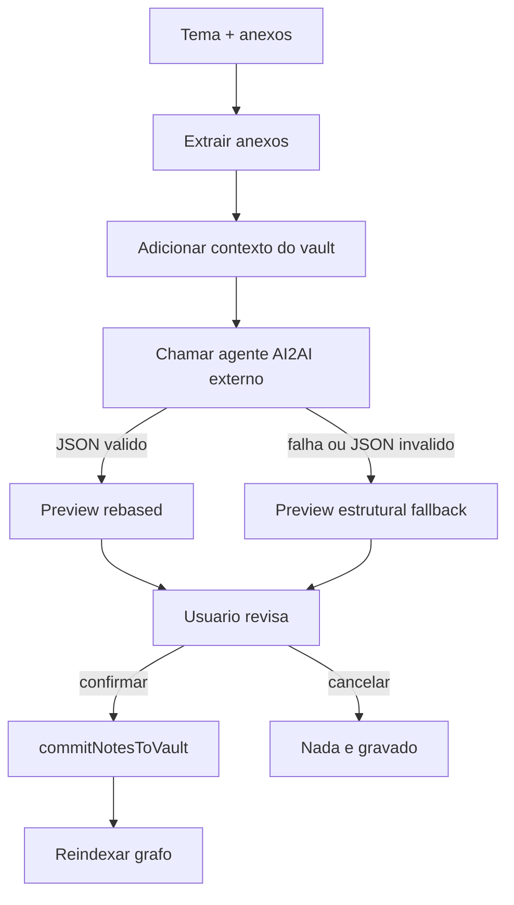

# AI2AI Pipeline

O modo `Note Creation` gera notas Markdown ricas para consumo por IA, mas nunca grava direto no vault. Primeiro o app monta um preview, mostra ao usuario e somente depois do aceite chama o commit.



## Entradas

- `topic`: pedido do usuario.
- `attachments`: textos/imagens extraidos.
- `graph`: notas existentes para cross-reference.
- `agentDir`: pasta externa do agente AI2AI.
- `ai2aiNotesDir`: subpasta do vault onde a saida sera escrita.

## Chamada do agente

`ai2ai.cjs` cria uma pasta temporaria, escreve `source.txt`, define `preview.json` como saida e executa:

```text
python <agentDir>/scripts/pdf_to_ai2ai_ollama.py --vault-path <VAULT_DIR> --source-text-file <source.txt> --out <preview.json> --model <MODEL> --ollama-host <HOST> --topic <TOPIC> --preview-only
```

O repositorio nao publica o agente externo. Ele deve ser instalado/configurado separadamente via `OBSPACE_AI2AI_AGENT_DIR`.

## Rebase de saida

`rebaseAi2AiPreview` garante que `preview.folder`, `note.folder` e `note.path` fiquem abaixo de `OBSPACE_AI2AI_NOTES_DIR`. Isso evita que um preview externo escreva fora da subpasta configurada.

## Commit no vault

`commitNotesToVault`:

1. sanitiza pasta e nomes de arquivo;
2. resolve caminho como filho de `<VAULT_DIR>`;
3. cria diretorio se necessario;
4. evita sobrescrita com sufixo numerico;
5. grava Markdown;
6. retorna notas escritas para atualizar o grafo.

## Fallback

Se o agente falhar, o app gera uma nota estrutural com fonte, metodologia AI2AI, contexto extraido e wikilinks relacionados. Isso preserva o fluxo de preview, mas sinaliza `warning` ao usuario.
