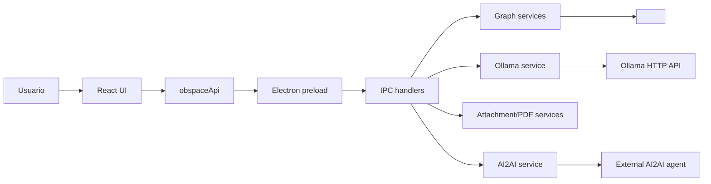

# Architecture Overview

Obspace Desktop combina um processo principal Electron, uma ponte preload segura e uma interface React renderizada pelo Vite. O app transforma arquivos Markdown de um vault em um grafo 3D navegavel, usa Ollama para chat contextual e chama um agente AI2AI externo para gerar previews de notas antes de gravar no vault.

## Camadas

| Camada | Arquivos principais | Proposito | Entradas | Saidas |
| --- | --- | --- | --- | --- |
| Main process | `electron/main.cjs`, `electron/bootstrap/*.cjs` | Inicializa Electron, janela e IPC. | Runtime config, eventos Electron. | Janela, handlers IPC, logs. |
| Preload | `electron/preload.cjs` | Expoe `window.obspace` sem liberar Node no renderer. | Chamadas do renderer. | Invocacoes IPC tipadas por canal. |
| Renderer | `src/app/*.jsx`, `src/features/**`, `src/styles.css` | UI, grafo 3D, chat e controles. | Config, grafo, telemetria, input do usuario. | Estado visual, chamadas `obspaceApi`. |
| Services | `electron/services/**` | Indexacao, chat, anexos, AI2AI, PDF, release helpers. | Vault, anexos, mensagens, ambiente. | `nodes`, `links`, respostas, PDFs, notas. |
| Scripts | `scripts/**` | Dev server, build, atalho e publicacao desktop local. | NPM scripts, arquivos do app. | `dist/`, `release/`, atalhos locais. |

## Contrato de dados principal

O grafo retorna:

- `generatedAt`: timestamp da indexacao.
- `vaultDir`: raiz configurada do vault.
- `stats`: contagens e problemas de resolucao de wikilinks.
- `nodes`: notas com `id`, `name`, `path`, `preview`, `degree`.
- `links`: conexoes `{ source, target }` entre notas.

O chat retorna:

- `role`, `model`, `mode`, `content`;
- `relevantNotes`, usados para rastrear contexto;
- `visualTelemetry`, usado para destacar leitura no grafo;
- `attachments` e `webResults` quando aplicavel.

## Fronteiras de seguranca

O renderer nao le arquivos diretamente. Ele chama `window.obspace`, que passa por IPC e executa no processo principal. O repositorio publica codigo e documentacao, mas nao publica vault, cache, build, release nem agente AI2AI externo.
