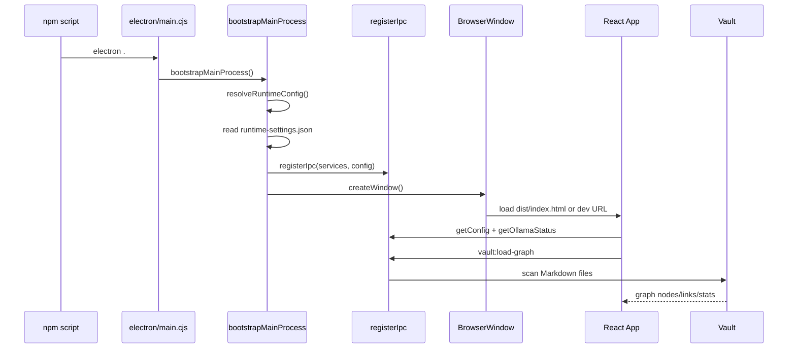

# Startup Flow

O startup separa inicializacao Electron, exposicao de API e carga do grafo. Em desenvolvimento, o Vite tambem fornece endpoints HTTP em `/__obspace` para permitir que parte da UI rode no navegador sem Electron.

## Producao

1. `electron/main.cjs` chama `bootstrapMainProcess`.
2. `runtime-config.cjs` resolve defaults genericos e variaveis `OBSPACE_*`.
3. `runtime-settings.cjs` tenta carregar o vault salvo em `app.getPath("userData")/runtime-settings.json`; se a pasta ainda existir, ela tem prioridade sobre o default inicial.
4. `register-ipc.cjs` registra canais para config, troca de vault, grafo, chat, anexos, AI2AI, PDF e atalho.
5. `create-window.cjs` cria `BrowserWindow` com `contextIsolation`.
6. `preload.cjs` expoe `window.obspace`.
7. `src/main.jsx` monta o React.
8. `useObspaceAppState.js` carrega config, status Ollama e grafo inicial.

## Troca de vault em runtime

O botao `Trocar vault` chama `vault:select-directory`, que abre o seletor nativo de pastas do Electron. O main process valida que o caminho escolhido e um diretorio, grava o novo `vaultDir` em `runtime-settings.json`, limpa o cache do grafo e reindexa usando a pasta nova. A UI recebe a config atualizada, limpa selecao/destaques e passa a usar o mesmo vault para leitura, chat, AI2AI e gravacao de notas.

## Desenvolvimento

`npm run dev` inicia `scripts/dev/dev.cjs`, que sobe Vite em `127.0.0.1:5177` e abre Electron apontando para essa URL. `scripts/dev/vite-runner.cjs` tambem cria rotas `/__obspace` para simular a ponte quando a UI roda fora do Electron.

## Erros de inicializacao

Falhas de vault, Ollama ou agente AI2AI nao devem interromper o processo Electron. A UI exibe status textual e o chat retorna mensagens explicitas quando Ollama ou modelo nao estao disponiveis.
