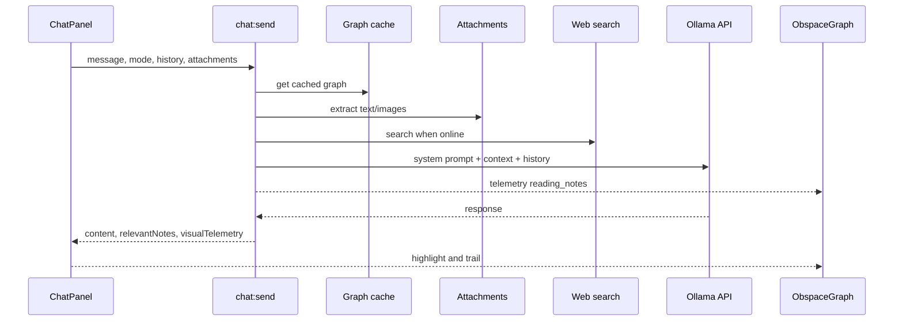

# Chat Pipeline

O chat e chat-first: o usuario pergunta no Soyuz, o processo principal monta contexto a partir do vault, anexos e opcionalmente web, chama Ollama e devolve resposta com telemetria visual para o grafo.

## Entradas

- Mensagem do usuario.
- `mode`: `offline` ou `online`.
- Historico compacto do chat.
- Anexos selecionados.
- Grafo cacheado do vault.

## Recuperacao de notas

`ollama.cjs` usa `findRelevantNotes` para buscar notas por similaridade lexical. O limite textual e maior que o limite visual: o modelo recebe ate 100 notas relevantes, mas a telemetria destaca menos nos para nao poluir a cena.

## Modos

- Offline: usa `OBSPACE_OFFLINE_MODEL`, vault, anexos e raciocinio local. Nao deve fingir web.
- Online: usa `OBSPACE_ONLINE_MODEL` e adiciona resultados de busca web quando disponiveis.

## Telemetria visual

Antes da chamada ao modelo, `buildReadingTelemetry` seleciona nos e links relacionados ao contexto. O renderer mostra a fase `reading_notes`; quando a resposta chega, transforma a leitura em trilha temporaria.

## Anexos

`attachments.cjs` extrai:

- PDF via `pdf-parse`;
- DOCX via `mammoth`;
- XLSX via `xlsx`;
- PPTX lendo XML interno via `jszip`;
- imagens em base64 para modelos com visao;
- texto/Markdown/JSON/CSS/JS e similares como texto.

## PDF

Quando a mensagem pede PDF, `ChatPanel` chama `chat:generate-pdf` depois da resposta. O main process converte Markdown normalizado para HTML temporario e usa `BrowserWindow.printToPDF`.

## Erros

Falhas de Ollama retornam resposta explicativa com `error` e telemetria resolvida. Falhas de PDF viram mensagem do assistente. Falhas de anexo ficam no item processado para o modelo ver o erro sem quebrar o fluxo inteiro.
